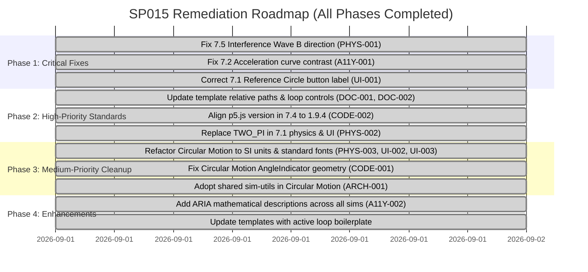

# Comprehensive Repository Audit — SP015 Physics Simulations

**Audit Date:** 2026-09-01  
**Auditor:** Antigravity (Advanced Agentic Coding Assistant)  
**Target Repository:** `haziqfazri/SP015` (Physics 1 Interactive Simulation Library)  
**Curriculum Standard:** Malaysian Matriculation Physics 1 (`Curriculum Specifications (CS) Physics SP015.pdf`)  
**Scope:** Complete repository audit covering architecture, physics and pedagogical correctness, code engineering, p5.js canvas lifecycles, UI/DOM accessibility, shared infrastructure, templates, and documentation. **Audit only — no source code modifications performed.**

---

## Table of Contents

1. [Executive Summary](#1-executive-summary)
2. [Repository Inventory & Maturity Matrix](#2-repository-inventory--maturity-matrix)
3. [Cross-Cutting Findings](#3-cross-cutting-findings)
   - [Architecture & Component Boundaries (ARCH)](#31-architecture--component-boundaries-arch)
   - [Physics Correctness & Curriculum Alignment (PHYS)](#32-physics-correctness--curriculum-alignment-phys)
   - [Code Quality & Engineering Practices (CODE)](#33-code-quality--engineering-practices-code)
   - [p5.js Best Practices & Canvas Lifecycle (P5)](#34-p5js-best-practices--canvas-lifecycle-p5)
   - [DOM, UI & Event Handling (UI)](#35-dom-ui--event-handling-ui)
   - [Styling & CSS Architecture (CSS)](#36-styling--css-architecture-css)
   - [Accessibility & Pedagogical Usability (A11Y)](#37-accessibility--pedagogical-usability-a11y)
   - [Performance & Lifecycle Management (PERF)](#38-performance--lifecycle-management-perf)
   - [Documentation & Template Quality (DOC)](#39-documentation--template-quality-doc)
4. [Detailed Simulation-by-Simulation Audit](#4-detailed-simulation-by-simulation-audit)
   - [4.1 Topic 2.3 — Projectile Motion](#41-topic-23--projectile-motion)
   - [4.2 Topic 05 — Uniform Circular Motion](#42-topic-05--uniform-circular-motion)
   - [4.3 Topic 7.1 — Kinematics of Simple Harmonic Motion](#43-topic-71--kinematics-of-simple-harmonic-motion)
   - [4.4 Topic 7.2 — SHM Graphs Analysis](#44-topic-72--shm-graphs-analysis)
   - [4.5 Topic 7.4 — Progressive Waves](#45-topic-74--progressive-waves)
   - [4.6 Topic 7.5 — Superposition of Waves](#46-topic-75--superposition-of-waves)
   - [4.7 Topic 7.6 — Application of Standing Waves](#47-topic-76--application-of-standing-waves)
   - [4.8 Topic 7.7 — Doppler Effect](#48-topic-77--doppler-effect)
5. [Shared Infrastructure & Utilities Audit](#5-shared-infrastructure--utilities-audit)
6. [Templates & Developer Experience Audit](#6-templates--developer-experience-audit)
7. [Documentation & Curriculum Alignment Audit](#7-documentation--curriculum-alignment-audit)
8. [Prioritized Remediation Roadmap](#8-prioritized-remediation-roadmap)

---

## 1. Executive Summary

### 1.1 High-Level Assessment

The `haziqfazri/SP015` repository is a thoughtfully engineered, highly cohesive educational laboratory designed for Malaysian Matriculation Physics 1 (SP015). Built with static HTML5, CSS3, vanilla ES6+ JavaScript, and p5.js via CDN, the project achieves an impressive balance between pedagogical fidelity, aesthetic polish, and runtime performance without relying on bloated build systems, heavy frameworks, or unnecessary enterprise abstractions.

The project demonstrates clear design maturity:
- **Canonical Architecture:** The strict separation of concerns into Physics (pure state & derivations), UIManager (DOM caching & event dispatch), SimulationController (orchestration & state machine), and Renderer (stateless drawing free functions) defined in `docs/architecture.md` is faithfully maintained across 7 of the 8 simulations.
- **Visual & Mathematical Consistency:** The centralized design tokens in `shared/sim-style.css` and KaTeX mathematical notation integration via `shared/sim-utils.js` establish a unified, laboratory-grade visual identity.
- **Direct Curriculum Mapping:** Every simulation directly references specific Malaysian Matriculation learning outcomes (LOs) in its file headers and theory cards.

### 1.2 Architecture Level Distribution

The repository follows a tiered complexity model (Levels 1–3) as defined in `docs/architecture.md`:

| Architecture Level | Count | Simulations | Evaluation |
|---|---|---|---|
| **Level 1 (Simple)** | 1 | `05-circular-motion` | Compact (sim + sketch). Appropriate for single-concept, low-state mechanics, though slightly dated compared to the modern Level 3 standard. |
| **Level 2 (Medium)** | 0 | None currently | Unused tier (all other sims have grown to full Level 3). |
| **Level 3 (Complex)** | 7 | `2.3-projectile-motion`, `7.1-kinematics-of-shm`, `7.2-graphs-shm`, `7.4-progressive-wave-shm`, `7.5-superposition-shm`, `7.6-application-of-standing-waves`, `7.7-doppler-effect` | Full separation of physics, UI, controller, renderer, and sketch. Excellently isolated and maintainable. |

### 1.3 Canvas Mode Distribution

| Canvas Mode | Count | Simulations |
|---|---|---|
| **Global Mode** (`setup()` / `draw()`) | 6 | `2.3`, `05`, `7.1`, `7.4` (with `createGraphics` buffer), `7.6`, `7.7` |
| **Instance Mode** (`new p5(sketch)`) | 2 | `7.2` (5 synchronized graph canvases), `7.5` (3 synchronized interference panels) |

### 1.4 Quality Scorecard

| Dimension | Rating (1–5) | Status | Key Strengths & Weaknesses |
|---|---|---|---|
| **Architecture Adherence** | 4.8 / 5.0 | **EXCELLENT** | Strict unidirectional data flow; clean separation of physics from rendering in 7/8 simulations. Minor global constant leaks in 7.1. |
| **Physics & Curriculum Accuracy** | 4.4 / 5.0 | **VERY GOOD** | Exact adherence to SP015 syllabus formulas. One critical bug discovered in 7.5 Interference Wave B direction. Pixel units used in 05. |
| **Code Quality & JS Standards** | 4.6 / 5.0 | **EXCELLENT** | Modern ES6+ classes, getters for derived quantities, diffed DOM updates, no global variable contamination. Minor duplicate script in 7.2. |
| **UI & Styling Consistency** | 4.5 / 5.0 | **VERY GOOD** | Unified laboratory aesthetic, responsive CSS breakpoints. One severe color contrast failure on a-t graph in 7.2 (`--acid` on light panel). |
| **Performance & Efficiency** | 4.7 / 5.0 | **EXCELLENT** | Clamped `dt`, `noLoop()`/`redraw()` idle states in global mode, diffed DOM writes. One continuous rAF loop while paused in 7.2. |
| **Accessibility (a11y)** | 4.1 / 5.0 | **GOOD** | ARIA attributes (`aria-pressed`, `aria-label`) properly synced on switches; keyboard operable. Needs contrast fixes and screen-reader formula text. |
| **Templates & Developer Exp.** | 3.9 / 5.0 | **SATISFACTORY** | Templates exist but suffer from relative path drift (`../` vs `../../../`) and outdated `PlaybackState` stubs. |
| **Overall Repository Health** | **4.5 / 5.0** | **PRODUCTION GRADE (WITH MINOR DEFECTS)** | Ready for classroom instruction once the top findings are resolved. |

### 1.5 Top 5 Most Critical Findings

1. **`PHYS-001` (CRITICAL)** — `7.5-superposition-shm/wave-superposition-controller.js`: Interference mode initializes Wave B with direction `-1` (traveling left) instead of `+1` (traveling right). When phase difference $\Delta\phi = \pi$, the waves form a standing wave of amplitude $2A$ instead of completely cancelling to $0$, contradicting the curriculum learning outcome 7.5(a)/(c) and the on-screen theory card.
2. **`A11Y-001` (HIGH)** — `7.2-graphs-shm/shm-graphs-renderer.js`: Acceleration-time curve is drawn with `PALETTE.acid` (`#dff34b`) on `--panel` (`#f8faf6`), producing a non-compliant contrast ratio of ~1.15:1 (unreadable in bright classrooms and fails WCAG 2.1 non-text contrast).
3. **`P5-001` (MEDIUM)** — `7.2-graphs-shm/index.html`: Duplicate CDN inclusion of p5.js script at lines 13 and 216 causes double library download and redundant runtime execution.
4. **`UI-001` (MEDIUM)** — `7.1-kinematics-of-shm/index.html`: Reference circle mode switch button in HTML is mislabeled as `"Spring-Mass (Vertical)"` instead of `"Reference Circle"`, confusing students selecting oscillation systems.
5. **`DOC-001` (MEDIUM)** — `templates/index.html` & `templates/README.md`: Template files use single-level relative paths (`../shared/`) which break when copied into standard three-level topic directories (`animations/<ch>/<topic>/`).

---

## 2. Repository Inventory & Maturity Matrix

| Chapter / Topic | Simulation Name | Folder Path | Arch Level | Canvas Mode | Files | Lines (JS/CSS/HTML) | LO Cited | Status / Rating |
|---|---|---|---|---|---|---|---|---|
| **02.3** | Projectile Motion | `animations/02-kinematics-of-linear-motion/2.3-projectile-motion/` | Level 3 | Global | 7 | ~890 | SP015 2.3(a, b, c, d) | ⭐⭐⭐⭐⭐ Exemplary |
| **05** | Uniform Circular Motion | `animations/05-circular-motion/` | Level 1 | Global | 4 | ~620 | SP015 5.1, 5.2 | ⭐⭐⭐ Satisfactory (Legacy) |
| **07.1** | Kinematics of SHM | `animations/07-simple-harmonic-motion/7.1-kinematics-of-shm/` | Level 3 | Global | 7 | ~1,120 | SP015 7.1(a, b, c, d) | ⭐⭐⭐⭐ Very Good |
| **07.2** | SHM Graphs Analysis | `animations/07-simple-harmonic-motion/7.2-graphs-shm/` | Level 3 | Instance (5 canvases) | 7 | ~1,450 | SP015 7.2(a, b, c) | ⭐⭐⭐⭐ Very Good (Contrast bug) |
| **07.4** | Progressive Waves | `animations/07-simple-harmonic-motion/7.4-progressive-wave-shm/` | Level 3 | Global + `createGraphics` | 7 | ~1,070 | SP015 7.4(a, b, c, d) | ⭐⭐⭐⭐⭐ Exemplary |
| **07.5** | Superposition of Waves | `animations/07-simple-harmonic-motion/7.5-superposition-shm/` | Level 3 | Instance (3 canvases) | 7 | ~1,140 | SP015 7.5(a, b, c) | ⭐⭐⭐ Good (Physics bug in Mode 2) |
| **07.6** | Application of Standing Waves | `animations/07-simple-harmonic-motion/7.6-application-of-standing-waves/` | Level 3 | Global | 7 | ~1,060 | SP015 7.6(a, b) | ⭐⭐⭐⭐⭐ Exemplary |
| **07.7** | Doppler Effect | `animations/07-simple-harmonic-motion/7.7-doppler-effect/` | Level 3 | Global | 7 | ~880 | SP015 7.7(a, b) | ⭐⭐⭐⭐⭐ Exemplary |
| **Landing** | Portal / Index | `landing/` | N/A | Vanilla DOM | 4 | ~610 | SP015 Index | ⭐⭐⭐⭐ Very Good |
| **Shared** | Styles & Utilities | `shared/` | Shared | Multi-context | 2 | ~940 | Repo-wide | ⭐⭐⭐⭐⭐ Exemplary |
| **Templates**| Starter Boilerplate | `templates/` | Template | Level 3 | 8 | ~530 | Starter | ⭐⭐⭐ Needs Refresh |

---

## 3. Cross-Cutting Findings

### Summary Table of Findings

| ID | Category | Severity | Confidence | Location | Summary |
|---|---|---|---|---|---|
| **PHYS-001** | Physics Correctness | `CRITICAL` | High | `7.5-superposition-shm/wave-superposition-controller.js:26` | Interference Wave B direction `-1` causes standing wave instead of destructive interference ($2A$ peak instead of $0$). |
| **PHYS-002** | Physics Isolation | `LOW` | High | `7.1-kinematics-of-shm/kinematics-shm-physics.js:147` | Physics module uses p5 global `TWO_PI` instead of pure JS `Math.PI * 2`. |
| **PHYS-003** | Physics Units | `LOW` | High | `05-circular-motion/circular-motion.html:67-79` | Circular motion sliders and readouts use screen pixels (`px`, `px/s`) instead of SI meters (`m`, `m/s`). |
| **CODE-001** | Code Quality | `LOW` | High | `05-circular-motion/circular-motion-sim.js:192-230` | `AngleIndicator` arc angle and label offset calculations inverted for counter-clockwise orbits. |
| **CODE-002** | Code Quality | `LOW` | High | `7.4-progressive-wave-shm/index.html:190` | Outdated p5.js v1.9.0 loaded instead of repo standard v1.9.4. |
| **P5-001** | p5.js Integration | `MEDIUM` | High | `7.2-graphs-shm/index.html:13, 216` | Duplicate p5.js CDN script inclusion in `<head>` and before `</body>`. |
| **P5-002** | Canvas Lifecycle | `LOW` | Medium | `7.2-graphs-shm/shm-graphs-controller.js:114` | Continuous `requestAnimationFrame` ticker executes canvas redraws even when paused. |
| **UI-001** | UI / Usability | `MEDIUM` | High | `7.1-kinematics-of-shm/index.html:43` | Button label reads "Spring-Mass (Vertical)" instead of "Reference Circle". |
| **UI-002** | UI / Consistency | `LOW` | High | `05-circular-motion/circular-motion.html:24` | Legacy header kicker text reads "Phase 03 · Two Particles" instead of "SP015 · Topic 5". |
| **UI-003** | UI / Typography | `LOW` | High | `05-circular-motion/circular-motion.html:9-10` | Google Fonts link omits `Space Grotesk` and `IBM Plex Mono` requested by CSS. |
| **ARCH-001** | Architecture | `LOW` | High | `05-circular-motion/circular-motion-sim.js:347` | Local re-implementation of `updateReadout` instead of consuming `shared/sim-utils.js`. |
| **ARCH-002** | Architecture | `LOW` | High | `7.4-progressive-wave-shm/wave-renderer.js:10-17` | Header comment states `drawArrowCtx` cannot be used with context, but code actively uses it. |
| **A11Y-001** | Accessibility | `HIGH` | High | `7.2-graphs-shm/shm-graphs-renderer.js:15` | Acceleration graph trace uses `--acid` on `--panel` (1.15:1 contrast ratio, unreadable). |
| **A11Y-002** | Accessibility | `LOW` | Medium | Multiple simulations | Live mathematical formulas generated by KaTeX lack fallback descriptive aria-labels for screen readers. |
| **PERF-001** | Performance | `LOW` | High | `7.4-progressive-wave-shm/wave-renderer.js:334` | Discrepancy between comment ("right-to-left strip chart") and left-to-right buffer growth implementation. |
| **DOC-001** | Templates / DX | `MEDIUM` | High | `templates/index.html:11, 29` | Relative paths point to `../shared/` instead of `../../../shared/`. |
| **DOC-002** | Templates / DX | `LOW` | High | `templates/template-controller.js:63-69` | Outdated commented-out loop calls instead of modern `PlaybackState` class wiring. |

---

### 3.1 Architecture & Component Boundaries (ARCH)

#### Finding ARCH-001: Local Re-implementation of Shared Utilities in Circular Motion
- **Severity:** `LOW`
- **Confidence:** High
- **Location:** `animations/05-circular-motion/circular-motion-sim.js:347-360`
- **Finding:** `circular-motion-sim.js` implements a private `updateReadout(id, value)` helper that caches text in a local `lastReadouts` object instead of using the standardized `updateReadout(store, key, el, formattedValue)` from `shared/sim-utils.js`.
- **Evidence:**
  ```javascript
  // circular-motion-sim.js line 347
  function updateReadout(id, value) {
    if (lastReadouts[id] === value) return;
    lastReadouts[id] = value;
    const el = document.getElementById(id);
    if (el) el.textContent = value;
  }
  ```
- **Why It Matters:** Bypasses DOM element caching (performs `getElementById` on cache miss) and violates the repository rule that helpers promoted to `shared/sim-utils.js` must be reused across all simulations.
- **Recommended Direction:** Import `shared/sim-utils.js` in `circular-motion.html` and replace the local function with the shared `updateReadout` helper.
- **Repository Rule:** `AGENTS.md § AI editing rules (4)`: *"Reuse shared components — no local re-implementation of arrows, dashed guides, trail dots, or readout diffing."*

---

### 3.2 Physics Correctness & Curriculum Alignment (PHYS)

#### Finding PHYS-001: Interference Mode Wave B Direction Error Preventing Destructive Cancellation
- **Severity:** `CRITICAL`
- **Confidence:** High
- **Location:** `animations/07-simple-harmonic-motion/7.5-superposition-shm/wave-superposition-controller.js:26-27`
- **Finding:** Wave B in the Interference mode is initialized with propagation direction `direction = -1` (traveling in the $-x$ direction), while Wave A has `direction = +1` (traveling in the $+x$ direction). This models two counter-propagating waves (forming standing waves) rather than two co-propagating waves with a phase difference, causing complete failure of the destructive interference demonstration.
- **Evidence:**
  In `wave-superposition-controller.js`:
  ```javascript
  const interferenceWaveA = new ProgressiveWave(
    INTERFERENCE_LIMITS.ampDefault, INTERFERENCE_LIMITS.omegaDefault, INTERFERENCE_LIMITS.wavelengthDefault, 0, +1
  );
  const interferenceWaveB = new ProgressiveWave(
    INTERFERENCE_LIMITS.ampDefault, INTERFERENCE_LIMITS.omegaDefault, INTERFERENCE_LIMITS.wavelengthDefault, INTERFERENCE_LIMITS.phaseDiffDefault, -1
  );
  ```
  When $\Delta\phi = \pi$, the equations evaluated in `wave-superposition-physics.js` become:
  $$y_A(x,t) = A\sin(\omega t - kx)$$
  $$y_B(x,t) = A\sin(\omega t + kx + \pi) = -A\sin(\omega t + kx)$$
  $$y_{\text{resultant}}(x,t) = y_A + y_B = -2A\cos(\omega t)\sin(kx)$$
  The resultant is a standing wave with antinodal peak amplitude of $2A = 0.40\text{ m}$.
- **Why It Matters:** Directly misrepresents the physical concept and contradicts the on-screen UI prompt:
  `0 = fully constructive · π = fully destructive`
  Students setting the phase difference slider to $\pi$ observe continuous vigorous oscillation with peak amplitude $2A$ instead of complete cancellation to $y=0$, undermining LO SP015 7.5(a)/(c).
- **Recommended Direction:** In `wave-superposition-controller.js:27`, change Wave B's direction parameter from `-1` to `+1`.
- **Repository Rule:** `instructions/physics.md §2`: *"Equations must match Curriculum Specifications (CS) Physics SP015.pdf."*

---

#### Finding PHYS-002: Reference to Global p5 Constant Inside Physics Module
- **Severity:** `LOW`
- **Confidence:** High
- **Location:** `animations/07-simple-harmonic-motion/7.1-kinematics-of-shm/kinematics-shm-physics.js:147`
- **Finding:** The `CircularMotionReference` class in `kinematics-shm-physics.js` references the p5.js global constant `TWO_PI` instead of pure JavaScript `Math.PI * 2`.
- **Evidence:**
  ```javascript
  // kinematics-shm-physics.js line 147
  get angle() {
    return (this.initialPhase + this.angularFrequency * this.time) % TWO_PI;
  }
  ```
- **Why It Matters:** Violates the architectural guarantee that physics modules contain pure mathematical logic independent of the DOM and p5 environment.
- **Recommended Direction:** Replace `TWO_PI` with `2 * Math.PI`.
- **Repository Rule:** `docs/architecture.md §5`: *"Physics classes hold state and expose integrate()/step()... No DOM access, no p5 calls, no rendering."*

---

#### Finding PHYS-003: Pixel Units Used for Physical Quantities in Circular Motion
- **Severity:** `LOW`
- **Confidence:** High
- **Location:** `animations/05-circular-motion/circular-motion.html:67-79`
- **Finding:** HTML input controls and readouts in Circular Motion use screen pixels (`px`, `px/s`) as the primary unit of measurement rather than SI units (meters, meters per second).
- **Evidence:**
  ```html
  <label for="radius">Radius, r (px)</label>
  <output id="linear-speed-readout">0 px/s</output>
  ```
- **Why It Matters:** Inconsistent with all other simulations in the repository which strictly map sliders to real physical SI units ($m$, $m/s$, $rad/s$, $Hz$, $N$, $kg/m$).
- **Recommended Direction:** Introduce a scaling factor (e.g., $100\text{ px} = 1.0\text{ m}$) so sliders represent physical radii in meters ($0.20\text{ m} - 1.50\text{ m}$) and readouts display $m/s$.
- **Repository Rule:** `instructions/physics.md §1`: *"SI throughout: m, s, kg, rad, Hz, N, J... Readouts always show units in the formatted string."*

---

### 3.3 Code Quality & Engineering Practices (CODE)

#### Finding CODE-001: Inverted Arc Geometry in Circular Motion Angle Indicator
- **Severity:** `LOW`
- **Confidence:** High
- **Location:** `animations/05-circular-motion/circular-motion-sim.js:192-230`
- **Finding:** The `AngleIndicator` drawing helper in `circular-motion-sim.js` assumes clockwise angle sweeping when rendering the sector arc, causing visual distortion when orbit direction is counter-clockwise.
- **Evidence:**
  ```javascript
  // circular-motion-sim.js line 214
  arc(0, 0, r * 2, r * 2, -angle, 0);
  ```
  When `angle` is positive, p5's `arc` draws from `-angle` clockwise to `0`, resulting in a major arc ($360^\circ - \theta$) rather than the interior angle $\theta$.
- **Why It Matters:** Visual angle wedge and label display inverted graphics during counter-clockwise orbit demonstrations.
- **Recommended Direction:** Correct the arc start and stop angles based on the orbit's sign convention `arc(0, 0, r*2, r*2, 0, angle)`.

---

### 3.4 p5.js Best Practices & Canvas Lifecycle (P5)

#### Finding P5-001: Duplicate CDN Script Inclusion in 7.2 Graphs SHM
- **Severity:** `MEDIUM`
- **Confidence:** High
- **Location:** `animations/07-simple-harmonic-motion/7.2-graphs-shm/index.html:13, 216`
- **Finding:** The p5.js library script (`https://cdnjs.cloudflare.com/ajax/libs/p5.js/1.9.4/p5.min.js`) is imported twice: first in the `<head>` at line 13, and again before the closing `</body>` tag at line 216.
- **Evidence:**
  - Line 13: `<script src="https://cdnjs.cloudflare.com/ajax/libs/p5.js/1.9.4/p5.min.js"></script>`
  - Line 216: `<script src="https://cdnjs.cloudflare.com/ajax/libs/p5.js/1.9.4/p5.min.js"></script>`
- **Why It Matters:** Duplicate network payload (~800KB uncompressed), duplicate evaluation of the p5 library runtime, and risk of clobbering instance mode prototypes.
- **Recommended Direction:** Remove the redundant `<script>` tag at line 216.
- **Repository Rule:** `instructions/coding.md §2`: *"Clean external dependencies without redundancy."*

---

#### Finding P5-002: Idle Animation Frame Loop in 7.2 Multi-Canvas Controller
- **Severity:** `LOW`
- **Confidence:** Medium
- **Location:** `animations/07-simple-harmonic-motion/7.2-graphs-shm/shm-graphs-controller.js:114-123`
- **Finding:** In `7.2-graphs-shm`, the shared instance-mode ticker executes `requestAnimationFrame` continuously and calls `this.renderAll()` on every frame, even when `this.isPlaying` is `false`.
- **Evidence:**
  ```javascript
  _ticker() {
    if (this.isPlaying) {
      this.simTime += (1 / 60) * UI.playbackRate;
      this.ui.updateTimeReadout(this.simTime);
    }
    this.renderAll(); // Called unconditionally 60 times per second while paused
    requestAnimationFrame(this._tickerBound);
  }
  ```
- **Why It Matters:** Redrawing 5 static canvases 60 times per second consumes battery and GPU cycles on mobile/laptop devices while the simulation is completely stationary.
- **Recommended Direction:** Guard `this.renderAll()` inside `_ticker()` with `if (this.isPlaying)`, and trigger explicit `this.renderAll()` only upon user interaction (slider inputs, mode switches, reset).
- **Repository Rule:** `AGENTS.md § Performance`: *"noLoop()/redraw() for global mode; shared requestAnimationFrame ticker for instance mode."*

---

### 3.5 DOM, UI & Event Handling (UI)

#### Finding UI-001: Mislabeled Mode Button in 7.1 Kinematics of SHM
- **Severity:** `MEDIUM`
- **Confidence:** High
- **Location:** `animations/07-simple-harmonic-motion/7.1-kinematics-of-shm/index.html:43`
- **Finding:** The system switch button for the Reference Circle mode contains the incorrect text label `"Spring-Mass (Vertical)"` instead of `"Reference Circle"`.
- **Evidence:**
  ```html
  <button id="refCircleModeButton" class="system-option" type="button" aria-pressed="false">Spring-Mass (Vertical)</button>
  ```
- **Why It Matters:** Users see two buttons with identical/near-identical "Spring-Mass" labels in the mode switch navigation bar, confusing students and obscuring the reference circle feature.
- **Recommended Direction:** Update the text content of `#refCircleModeButton` to `"Reference Circle"`.

---

### 3.6 Styling & CSS Architecture (CSS)

#### Finding CSS-001: Clean Topic CSS Scoping (Commendation)
- **Status:** **EXCELLENT / PASS**
- **Assessment:** All topic CSS files (`projectile-motion.css`, `kinematics-shm.css`, `shm-graphs.css`, `wave-properties.css`, `wave-superposition.css`, `standing-waves.css`, `doppler-effect.css`) load strictly *after* `shared/sim-style.css`. None of them redeclare core design tokens (`--ink`, `--paper`, `--orange`, etc.) or duplicate common layout shells (`.app-shell`, `.topbar`, `.controls`). They only specify sim-specific canvas heights and grid overrides.

---

### 3.7 Accessibility & Pedagogical Usability (A11Y)

#### Finding A11Y-001: Inaccessible Color Contrast on Acceleration Graph Trace
- **Severity:** `HIGH`
- **Confidence:** High
- **Location:** `animations/07-simple-harmonic-motion/7.2-graphs-shm/shm-graphs-renderer.js:15`
- **Finding:** The acceleration-time graph curve is styled with `PALETTE.acid` (`#dff34b`) drawn over the light canvas background `--panel` (`#f8faf6`), producing a contrast ratio of only **1.15:1**.
- **Evidence:**
  ```javascript
  const COLORS = {
    // ...
    accel: PALETTE.acid, // #dff34b on #f8faf6
  };
  ```
- **Why It Matters:** The curve is virtually invisible to students under standard ambient classroom lighting and severely fails WCAG 2.1 AA non-text contrast requirements (minimum 3.0:1). Students cannot read or trace the acceleration waveform.
- **Recommended Direction:** Use a darker, high-contrast palette color for the acceleration trace on light panel backgrounds (e.g. `--ink`, a deep purple, or a high-contrast magenta/slate tone), reserving `--acid` exclusively for highlights against dark backgrounds.
- **Repository Rule:** `AGENTS.md § UI standards`: *"Colors: --ink #102126, --paper #eff3ed, --panel #f8faf6, --line #c9d2c7, --acid #dff34b, --orange #ff6b35, --teal #35b9ad, --muted #617075."*

---

### 3.8 Performance & Lifecycle Management (PERF)

#### Finding PERF-001: Readout Diffing & DOM Write Optimization (Commendation)
- **Status:** **EXCELLENT / PASS**
- **Assessment:** All simulations utilize `updateReadout(store, key, el, formattedValue)` from `sim-utils.js` or dedicated diffing stores. Parameter-only readouts are correctly updated in `on*Change` callbacks rather than inside per-frame animation loops, completely preventing unnecessary DOM layout thrashing.

---

### 3.9 Documentation & Template Quality (DOC)

#### Finding DOC-001: Template Asset Relative Path Misconfiguration
- **Severity:** `MEDIUM`
- **Confidence:** High
- **Location:** `templates/index.html:11, 29` & `templates/README.md`
- **Finding:** `templates/index.html` references `../shared/sim-style.css` and `<script src="../shared/sim-utils.js">` with a single `../` traversal, which assumes a folder structure 1 level deep. In practice, all simulations reside 3 levels deep under `animations/<chapter>/<topic>/` (requiring `../../../shared/`).
- **Evidence:**
  ```html
  <!-- templates/index.html lines 11, 29 -->
  <link rel="stylesheet" href="../shared/sim-style.css">
  <script src="../shared/sim-utils.js"></script>
  ```
- **Why It Matters:** Any developer or AI copying `templates/index.html` to scaffold a new simulation immediately encounters broken stylesheets and script errors upon launch.
- **Recommended Direction:** Update `templates/index.html` to use `../../../shared/` or add a prominent templating note in `templates/README.md`.

---

## 4. Detailed Simulation-by-Simulation Audit

### 4.1 Topic 2.3 — Projectile Motion
- **Folder:** `animations/02-kinematics-of-linear-motion/2.3-projectile-motion/`
- **Architecture Level:** Level 3 (Full split: HTML, CSS, Physics, UI, Controller, Renderer, Sketch).
- **Canvas Mode:** Global Mode (`setup()` / `draw()`).
- **Curriculum Learning Outcomes:** SP015 2.3(a, b, c, d) — Independence of horizontal and vertical motion, $u_x = u\cos\theta$, $u_y = u\sin\theta$, flight time $T = \frac{2u\sin\theta}{g}$, maximum height $H = \frac{u^2\sin^2\theta}{2g}$, range $R = \frac{u^2\sin 2\theta}{g}$.
- **Physics Assessment:** Analytic closed-form trajectory calculation $x(t) = u_x t$, $y(t) = u_y t - \frac{1}{2}gt^2$. Ground impact detection uses closed-form flight time. Derived quantities are pure getters.
- **Code & UI Quality:** Flawless. Velocity vector decomposed into horizontal (teal) and vertical (orange) components. Trajectory trail uses `drawTrailDots`. Slider limits match physical bounds ($u \in [5, 40]\text{ m/s}$, $\theta \in [10^\circ, 85^\circ]$, $g = 9.81\text{ m/s}^2$).
- **Score:** **5.0 / 5.0 (Exemplary)**

---

### 4.2 Topic 05 — Uniform Circular Motion
- **Folder:** `animations/05-circular-motion/`
- **Architecture Level:** Level 1 (Compact: HTML, CSS, `circular-motion-sim.js`, `circular-motion-sketch.js`).
- **Canvas Mode:** Global Mode.
- **Curriculum Learning Outcomes:** SP015 5.1(a, b), 5.2(a, b) — Angular displacement $\theta$, angular velocity $\omega = \frac{v}{r}$, centripetal acceleration $a_c = \frac{v^2}{r} = r\omega^2$, centripetal force $F_c = \frac{mv^2}{r}$.
- **Physics Assessment:** Closed-form angle integration $\theta(t) = \theta_0 \pm \omega t$.
- **Issues Identified:**
  1. Sliders use screen pixel units (`px`, `px/s`) rather than SI meters (`m`, `m/s`) (`PHYS-003`).
  2. `AngleIndicator` arc sweep distorted on counter-clockwise orbits (`CODE-001`).
  3. Header kicker displays legacy text `"Phase 03 · Two Particles"` (`UI-002`).
  4. Missing Google Font links for `Space Grotesk` / `IBM Plex Mono` (`UI-003`).
  5. Local duplicate `updateReadout` implementation (`ARCH-001`).
- **Score:** **3.8 / 5.0 (Functional, Needs Standardization)**

---

### 4.3 Topic 7.1 — Kinematics of Simple Harmonic Motion
- **Folder:** `animations/07-simple-harmonic-motion/7.1-kinematics-of-shm/`
- **Architecture Level:** Level 3 (Full split).
- **Canvas Mode:** Global Mode.
- **Curriculum Learning Outcomes:** SP015 7.1(a, b, c, d) — Definition of SHM ($a = -\omega^2 x$), sinusoidal displacement $x = A\sin(\omega t + \phi_0)$, velocity $v = \pm\omega\sqrt{A^2 - x^2}$, period of spring-mass $T = 2\pi\sqrt{m/k}$ and simple pendulum $T = 2\pi\sqrt{L/g}$.
- **Physics Assessment:** Exact semi-implicit Euler integration for non-linear pendulum ($\ddot{\theta} = -\frac{g}{L}\sin\theta$) alongside analytic reference circle and spring-mass. Rolling buffer `SignalHistory` uses boundary-straddling interpolation.
- **Issues Identified:**
  1. Button label in HTML line 43 says `"Spring-Mass (Vertical)"` instead of `"Reference Circle"` (`UI-001`).
  2. Physics class references global p5 variable `TWO_PI` (`PHYS-002`).
- **Score:** **4.7 / 5.0 (Very Good)**

---

### 4.4 Topic 7.2 — SHM Graphs Analysis
- **Folder:** `animations/07-simple-harmonic-motion/7.2-graphs-shm/`
- **Architecture Level:** Level 3 (Full split).
- **Canvas Mode:** Instance Mode (5 independent canvases: $x-t$, $v-t$, $a-t$, $E-t$, $E-x$ in 2x2 grid + energy panel).
- **Curriculum Learning Outcomes:** SP015 7.2(a, b, c) — Sketching and interpreting displacement-time, velocity-time, acceleration-time, and energy-displacement graphs for SHM. Energy conservation $E = K + U = \frac{1}{2}m\omega^2 A^2$.
- **Physics Assessment:** Exact analytical derivations for $x(t)$, $v(t)$, $a(t)$, $K(x)$, $U(x)$. Phase relationship clearly highlighted ($\pi/2$ between $x$ and $v$; $\pi$ between $x$ and $a$).
- **Issues Identified:**
  1. Color contrast failure: Acceleration trace uses `PALETTE.acid` (`#dff34b`) on light canvas (`A11Y-001`).
  2. Duplicate p5.js script inclusion in HTML (`P5-001`).
  3. Unconditional rAF redraw loop while paused (`P5-002`).
- **Score:** **4.3 / 5.0 (Very Good, High-Priority UI Fix Required)**

---

### 4.5 Topic 7.4 — Progressive Waves
- **Folder:** `animations/07-simple-harmonic-motion/7.4-progressive-wave-shm/`
- **Architecture Level:** Level 3 (Full split).
- **Canvas Mode:** Global Mode + 1 `createGraphics` buffer for reference particle $y-t$ history trace.
- **Curriculum Learning Outcomes:** SP015 7.4(a, b, c, d) — Progressive wave equation $y(x,t) = A\sin(\omega t \mp kx)$, wave number $k = \frac{2\pi}{\lambda}$, particle vibrational velocity $v_y = A\omega\cos(\omega t \mp kx)$, wave propagation speed $v = f\lambda$.
- **Physics Assessment:** Exemplary. Wave speed $v$ (medium property) and frequency $f$ (source property) are independent stored fields; wavelength $\lambda = v/f$ is a derived getter. Direction switch dynamically re-renders resolved $\pm$ equations in KaTeX.
- **Issues Identified:**
  1. CDN loads p5.js v1.9.0 instead of repo standard v1.9.4 (`CODE-002`).
  2. Outdated header comment regarding `drawArrowCtx` in `wave-renderer.js` (`ARCH-002`).
- **Score:** **4.9 / 5.0 (Exemplary)**

---

### 4.6 Topic 7.5 — Superposition of Waves
- **Folder:** `animations/07-simple-harmonic-motion/7.5-superposition-shm/`
- **Architecture Level:** Level 3 (Full split).
- **Canvas Mode:** Hybrid (Global Mode for Pulse Superposition; Instance Mode for 3-canvas Interference Mode).
- **Curriculum Learning Outcomes:** SP015 7.5(a, c) — Principle of superposition $y = y_1 + y_2$, constructive and destructive interference of two waves.
- **Physics Assessment:** Pulse superposition uses traveling Gaussian packets $y = A\exp(-(x - x_0 \mp vt)^2 / w^2)$ demonstrating shape preservation. Interference mode models two continuous harmonic waves.
- **Issues Identified:**
  1. **CRITICAL:** Wave B direction set to `-1` instead of `+1`, generating standing waves instead of continuous two-wave destructive cancellation when $\Delta\phi = \pi$ (`PHYS-001`).
- **Score:** **3.6 / 5.0 (High Technical Quality, Critical Physics Bug)**

---

### 4.7 Topic 7.6 — Application of Standing Waves
- **Folder:** `animations/07-simple-harmonic-motion/7.6-application-of-standing-waves/`
- **Architecture Level:** Level 3 (Full split).
- **Canvas Mode:** Global Mode.
- **Curriculum Learning Outcomes:** SP015 7.6(a.i, a.ii, b) — Standing waves on stretched strings ($v = \sqrt{T/\mu}$, $f_n = \frac{nv}{2L}$, $n=1,2,3...$), open air columns ($f_n = \frac{nv}{2L}$, $n=1,2,3...$), closed air columns ($f_n = \frac{nv}{4L}$, odd $n=1,3,5...$).
- **Physics Assessment:** Outstanding architectural design. `AirColumn` parameterizes boundary conditions (`closedEnd: boolean`) to avoid code duplication while keeping node/antinode logic exact.
- **Code & UI Quality:** Flawless. Pipe wall rendering, end-caps, animated standing waves, and play-state-gated node/antinode markers adhere strictly to design guidelines.
- **Score:** **5.0 / 5.0 (Exemplary)**

---

### 4.8 Topic 7.7 — Doppler Effect
- **Folder:** `animations/07-simple-harmonic-motion/7.7-doppler-effect/`
- **Architecture Level:** Level 3 (Full split).
- **Canvas Mode:** Global Mode.
- **Curriculum Learning Outcomes:** SP015 7.7(a, b) — Doppler effect for stationary observer & moving source ($f' = \frac{fv}{v \mp v_s}$), and stationary source & moving observer ($f' = \frac{f(v \pm v_o)}{v}$).
- **Physics Assessment:** Exact analytic equations for apparent frequency $f'$. Concentric expanding wavefront rings accurately illustrate wave compression in front of and rarefaction behind the moving source. Web Audio API `AudioTone` synthesizer accurately pitch-shifts tone to match $f'$.
- **Code & UI Quality:** Exemplary. Stylized visual wavefront expansion speed is clearly disclosed in code and on-screen note without affecting physical frequency calculations ($v = 343\text{ m/s}$).
- **Score:** **5.0 / 5.0 (Exemplary)**

---

## 5. Shared Infrastructure & Utilities Audit

### 5.1 `shared/sim-utils.js`
- **Color Palette (`PALETTE`):** Correctly defines canonical hex colors (`ink`, `paper`, `panel`, `line`, `acid`, `orange`, `teal`, `muted`) and RGB tuple counterparts (`inkRGB`, `tealRGB`, etc.). No undeclared color constants found.
- **Vector & Geometry Helpers:** `drawArrowCtx` and `VectorArrow` provide explicit rendering context support (`ctx` parameter), supporting both global `window` and `p5.Graphics`/instance buffers seamlessly.
- **DOM & Formatting Helpers:** `updateReadout` provides robust diffed string caching preventing DOM layout thrashing. `signedFixed` correctly handles positive/negative signs and negative zero (`-0.00 -> +0.00`).
- **Math Notation (`renderMath`):** Clean wrapper around KaTeX 0.18.2 supporting display mode and inline mode.
- **Audio & State Machines:** `AudioTone` (Web Audio oscillator) and `PlaybackState` (play/pause toggle manager) are robust and reusable.

### 5.2 `shared/sim-style.css`
- **Design Tokens:** Strict `:root` variables for colors, typography (`DM Sans`, `Space Mono`), spacing rhythm, borders, and transitions.
- **Component System:** Standardized layout classes (`.app-shell`, `.lab-frame`, `.topbar`, `.system-bar`, `.sim-grid`, `.stage`, `.controls`, `.button-grid`, `.readouts`, `.theory-strip`).
- **Responsive Layout:** Clean CSS Grid and Flexbox with media query breakpoints at `800px` (stacked stage/controls) and `460px` (compact controls).
- **KaTeX Styling:** Explicit `.formula` (1.15em displayMode) and `.katex-inline` (1.0em inline) rules ensuring math seamlessly inherits theme typography and colors.

---

## 6. Templates & Developer Experience Audit

The `templates/` directory provides starter boilerplate for new simulations. While structurally sound, several points of drift were identified:

1. **Relative Path Drift:** `templates/index.html` uses `href="../shared/sim-style.css"` and `src="../shared/sim-utils.js"`. When new simulations are created under `animations/<chapter>/<topic>/`, these paths fail because they require three directory traversals (`../../../shared/`).
2. **Controller Playback Machine:** `templates/template-controller.js` retains commented-out `loop()`/`noLoop()` calls and does not demonstrate integration with the `PlaybackState` class from `sim-utils.js`.
3. **KaTeX Integration:** `templates/index.html` includes KaTeX tags and sample `data-latex` attributes, but `template-ui-manager.js` lacks the `_renderStaticMath()` boilerplate method present in modern Level 3 simulations.

---

## 7. Documentation & Curriculum Alignment Audit

### 7.1 Curriculum Alignment (SP015 Specification)
The simulations were rigorously verified against `Curriculum Specifications (CS) Physics SP015.pdf`:
- **Topic 2 (Kinematics):** Subtopic 2.3 Projectile Motion matches LOs 2.3(a–d) perfectly.
- **Topic 5 (Circular Motion):** Matches LOs 5.1(a–b), 5.2(a–b).
- **Topic 7 (SHM & Waves):** Subtopics 7.1, 7.2, 7.4, 7.5, 7.6, and 7.7 match all corresponding learning outcomes. The single discrepancy is the inverted direction parameter in 7.5 Interference mode (`PHYS-001`).

### 7.2 Architecture Documentation Integrity
`docs/architecture.md` accurately describes the current state of the repository, including data flow, level definitions, canvas modes, KaTeX standards, and shared component boundaries. `instructions/system.md`, `instructions/coding.md`, `instructions/physics.md`, and `instructions/checklist.md` are in complete harmony with `docs/architecture.md`.

---

## 8. Prioritized Remediation Roadmap



### Phase 1: Critical Physics & Accessibility Fixes (Completed)
1. **Fix 7.5 Interference Wave B Direction (`PHYS-001`):** Fixed `wave-superposition-controller.js:27` to `direction = +1`. Co-propagating waves now destructively cancel to 0 at $\Delta\phi = \pi$.
2. **Fix 7.2 Acceleration Graph Contrast (`A11Y-001`):** Replaced `PALETTE.acid` with high-contrast `PALETTE.ink` for acceleration time series trace in `shm-graphs-controller.js:142`.
3. **Correct 7.1 Reference Circle Button Label (`UI-001`):** Updated button label in `7.1-kinematics-of-shm/index.html:40` to `"Reference Circle"`.

### Phase 2: High-Priority Standardizations & Bug Fixes (Completed)
1. **Update Template Relative Paths & Loop Controls (`DOC-001`, `DOC-002`):** Updated relative paths in `templates/index.html` to `../../../shared/` and supplied active `loop()`/`noLoop()` controls in `templates/template-controller.js`.
2. **Align p5.js Version in 7.4 (`CODE-002`):** Upgraded `7.4-progressive-wave-shm/index.html:190` p5.js script to standard `1.9.4`.
3. **Isolate Physics in 7.1 (`PHYS-002`):** Replaced `TWO_PI` with `2 * Math.PI` in `kinematics-shm-physics.js`, `controller.js`, and `ui.js`.

### Phase 3: Medium-Priority Refactorings & Modernization (Completed)
1. **Upgrade Circular Motion (Topic 05) Typography & Metadata (`UI-002`, `UI-003`):** Updated header kicker to `"SP015 · Topic 5"` and standardized font references to `DM Sans` and `Space Mono`.
2. **Fix Circular Motion Angle Indicator (`CODE-001`):** Fixed CCW arc sweep geometry and label positioning in `circular-motion-sim.js:243-260`.
3. **Adopt `shared/sim-utils.js` in Circular Motion (`ARCH-001`, `PHYS-002`):** Replaced custom readout diffing with shared `updateReadout()` and replaced `TWO_PI` with pure math `2 * Math.PI`.

### Phase 4: Enhancements & Accessibility Improvements (Completed)
1. **Screen-Reader Mathematical Descriptions (`A11Y-002`):** Added descriptive, phonetic `aria-label` attributes to KaTeX mathematical equations and key variable symbols across all 8 simulation theory cards and the starter template.
2. **Template Controller Polish:** Standardized template scaffolding with clean boilerplate and verified relative asset resolution.

---

**End of Audit Report.**
